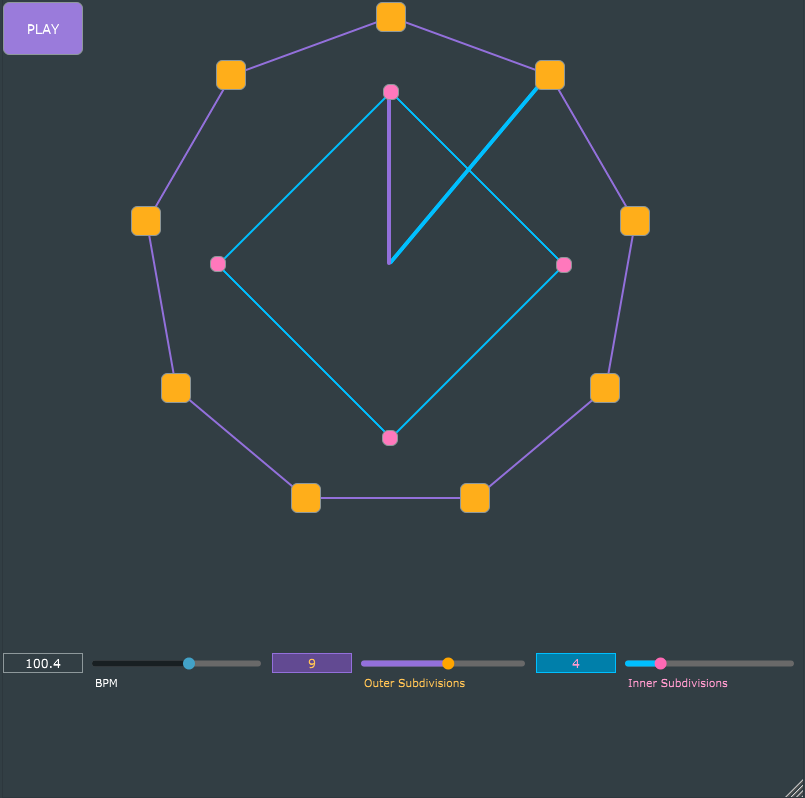

# MetroGnome: Standalone Metronome Application

**MetroGnome** is a simple standalone metronome application designed for musicians who want to practice along to polyrhythms. It allows for the simultaneous playback of two sequences of beats, and by adjusting the divisions of beats in each sequence, you can create complex rhythms. 

## Features

- **Dual Sequence Playback**: Visualize and hear two simultaneous sequences of beats.
- **BPM Adjustment**: Easily adjust the beats per minute to match your practice pace.
- **Subdivision Control**: Modify the number of subdivisions within each sequence for intricate rhythm patterns.
- **Beat Customization**: Toggle individual beats on or off to experiment with different rhythmic combinations.
- **Dynamic User Interface**: UI changes based on number of subdivisions in each sequence.